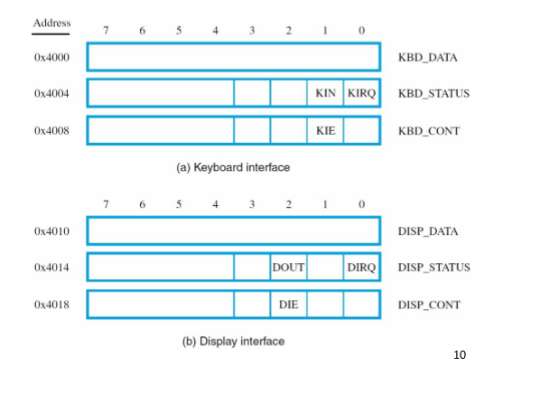

# IO
## IO interface example
- Keyboard has KIN status flag in bit b_1 of KBD_STATUS register
- Processor polls KBD_STATUS register, checking if KIN flag is 0 or 1
- if KIN is 1, processor reads KBD_DATA register


## Wait Loop For Polling I/O Status
- Program-controlled I/O implemented with a wait loop for polling keyboard status register:
```asm
WRITEWAIT:
  LoadByte  R4, DISP_STATUS
  AND       R4, R4, #4
  Branch_if_[R4]=0 WRITEWAIT
  StoreByte  R5, DISP_DATA
```
- Display Circuit sets DOUT flag in DISP_STATUS after previous character has been displayed
- Circuit clears DOUT flag when DISP_DATA register is written
```asm
READWAIT:
  LoadByte  R4, KBD_STATUS
  AND       R4, R4, #2
  Branch_if_[R4]=0 READWAIT
  LoadByte  R5, KBD_DATA
```
- Keyboard sircuit places character in KBD_DATA and sets KIN flag in KBD_STATUS
- Circuit clears KIN flag when KBD_DATA is read