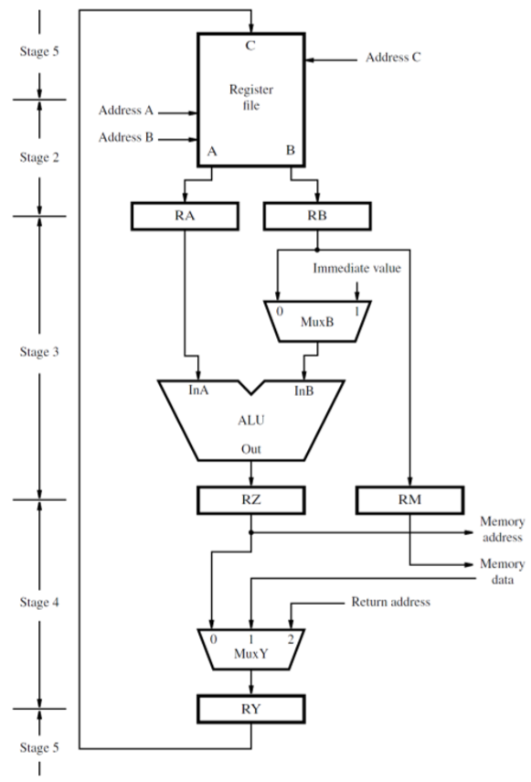

# general 5-steps
1. Fetch an instruction and increment the program counter
2. Decode the instruction and read registers from the register file
3. Perform an ALU operation
4. Read or write memory data if the instruction invloves a memory operand
5. Write the result into the destination register, if needed.
# hardware stages diagram from datapath

# Steps of Execution in RTN
## operation instruction between the contents of 2 registers
Op Rd, Rs, Rt
- memory address <- [PC], read memory, IR <- memory data, PC <- [PC] + 4
- decode instruction, RA <- [Rs], RB <- [Rt]
- RZ <- [RA] Op [RB]
- RY <- [RZ]
- Rd <- [RY]
## operation instruction between the contents of a register and immediate value
Op Rd, Rs, #X
- memory address <- [PC], read memory, IR <- memory data, PC <- [PC] + 4
- decode instruction, RA <- [Rs]
- RZ <- [RA] Op X
- RY <- [RZ]
- Rd <- [RY]
## Load instruction
Load Rt, X(Rs)
- memory address <- [PC], read memory, IR <- memory data, PC <- [PC] + 4
- decode instruction, RA <- [Rs]
- RZ <- [RA] + X
- memory address <- [RZ], read memory, RY <- memory data
- Rt <- [RY]
## Store instruction
Store Rt, X(Rs)
- memory address <- [PC], read memory, IR <- memory data, PC <- [PC] + 4
- decode instruction, RA <- [Rs], RB <- [Rt]
- RZ <- [RA] + X, RM <- [RB]
- memory address <- [RZ], memory address <- RB, write memory
- no action
## Unconditional Branch instruction
Br Label
- memory address <- [PC], read memory, IR <- memory data, PC <- [PC] + 4
- decode instruction
- PC <- [PC] + branch offset from IR
- no action
- no action
## Conditional Branch instruction
Branch_if_[Rs]{Op}[Rt] Label
- memory address <- [PC], read memory, IR <- memory data, PC <- [PC] + 4
- decode instruction, RA <- [Rs], RB <- [Rt]
- compare RA to RB, if [RS]{Op}[Rt] is satisfied, PC <- [PC] + branch offset from IR
- no action
- no action
## Call instruction
Call Label
- memory address <- [PC], read memory, IR <- memory data, PC <- [PC] + 4
- decode instruction
- PC-Temp <- [PC], PC <- address from instruction
- RY <- [PC-Temp]
- Link register in GPR file <- [RY]
## Return instruction
Return
- memory address <- [PC], read memory, IR <- memory data, PC <- [PC] + 4
- decode instruction, RA <- [Link register in GPR file]
- PC <- [RA]
- No action
- No Action
# Logic Expressions for control signals
- IR_en: T1
- PC_en: T1 + T3(Branch + Call) 
- RF_Write: T5(Load, ALU, Call)
- MEM_read: T1 + T4(Load)
- MEM_write: T4(Store)
- MA_Select: T1
# comments on datapath Control Signals
- Possible sources for the data contents placed in register RY for instructions that modify a register in the programmer-visible register file
1. RZ(ALU result)
2. memory data(Load)
3. return address(Call/PC_temp)
- Possible sources for the identifier of the register to be modified in the programmer-visible regiter file
1. RM
2. RZ
3. PC_temp
- Simply list the signals/connections that constitute the interface between the processor and the memory
1. data in(from RM)/data out(to IR)
2. memory read/memory write
3. MFC out
4. address in(from MuxMA)
5. multiplexes RZ(0) or PC(1)