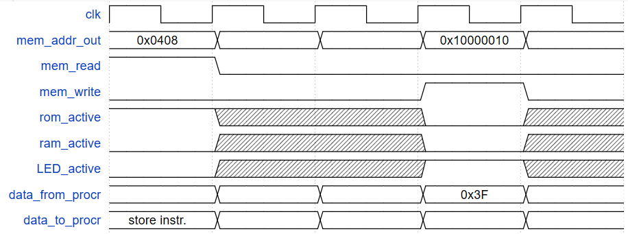

# Basic Input/Output
## I/O timing diagram
- The DE0 Computer LED port data register address is 0x10000010. turn on the bottom/lowest 6 LEDs.
```
movia r2, 0x10000010
movi  r3, 0x3F
stwio r3, 0(r2)
```
The code above begins at ROM address 0x0400. For the store instruction that accesses the LED data register complete the timing diagram below.



<!-- https://wavedrom.com/editor.html
{signal: [
  {name: 'clk', wave: 'p....'},
  {name: 'mem_addr_out', wave: '=====', data: ['0x0408', '', '', '0x10000010']},
  {name: 'mem_read', wave: '10...'},
  {name: 'mem_write', wave: '0..10'},
  {name: 'rom_active', wave: '1xx0x'},
  {name: 'ram_active', wave: '0xx0x'},
  {name: 'LED_active', wave: '0xx1x'},
  {name: 'data_from_procr', wave: '=====', data: ['', '', '', '0x3F', '']},
  {name: 'data_to_procr', wave: '=====', data: ['store instr.', '', '', '', '']},
],  "config" : { "hscale" : 3 }
} -->
## parallel I/O and interrupt
- Identify important steps that processor hardware must perform before executing the first instruction of an interrupt service routine.
  1. after recognizing interrupt, save PC valule (to ea in Nios II)
  2. save processor status register (to estatus in Nios II)
  3. clear global interrupt-enable bit in status register to zero
  4. set PC with address of first instruction of service routine
  5. proceed with fetching an instruciton for execution 
- What state information does Nios II hardware save on interrupts? Where?
  - PC value is saved in ea (one of the gen-purpose registers)
  status reg. value is saved in estatus (a special register in the processer)
- Describe the specific actitons of the `eret` instructiton (excluding fetch/decode activity that is common to all instructions).
  - copy saved value in estatus to status (restore interrupt-enable bit value of 1)
  - copy saved value in ea to pc (return address to resume main program)
- What is the benefit of having the ienable register in the Nios II processor
  - allows selective enabling/disabling recognition of interrupt requests from individual devices without affecting recognition of requests for other devices.
- What is the benefit of having the ipending register, i.e., if it was absent, ,what would be the impact no the programmer and/or the system?
  - combines information about devices requesting interrupt service into one register within the processor -- this avoids having to make many individual external memory-mapped access to I/O registers in order to identify interrupts sources, which reduces the numer of bus transactions and possibly execution time.
- For a system based on the Nios II processor, briefly identify the different places in the system hardware where interrupts can be enabled or disabled.
  - device I/O control register;
  - Nios II ienable register;
  - Nios II status register;